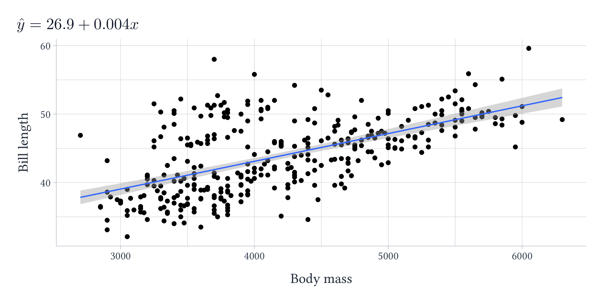

<!-- README.md is generated from README.Rmd. Please edit that file -->

```{r, include = FALSE}
knitr::opts_chunk$set(
  collapse = TRUE,
  comment = "#>",
  fig.path = "man/figures/README-",
  dpi = 300,
  out.width = "100%"
)
```

# kfbmisc

<!-- badges: start -->
<!-- badges: end -->

`kfbmisc` is a package full of utility function I find useful

## Installation

You can install the development version of kfbmisc from [GitHub](https://github.com/) with:

``` r
# install.packages("devtools")
devtools::install_github("kylebutts/kfbmisc")
```

```{r}
library(kfbmisc)
```

## `ggplot2` theme

This is a relatively simple theme that makes the font larger for figures and adds more margins around things. 

```{r}
#| fig.width: 8
#| fig.height: 4
library(ggplot2)
library(palmerpenguins)

penguins = subset(penguins, !is.na(body_mass_g) & !is.na(bill_length_mm))

ggplot(penguins) +
  geom_point(aes(x = body_mass_g, y = bill_length_mm)) +
  labs(
    x = "Body mass", y = "Bill length"
  ) +
  theme_kyle(base_size = 12)
```

```{r}
#| fig.width: 8
#| fig.height: 4
ggplot(penguins) +
  geom_point(aes(x = body_mass_g, y = bill_length_mm)) +
  facet_wrap(~ species) +
  labs(
    x = "Body mass", y = "Bill length"
  ) +
  theme_kyle(base_size = 12)
```

### Maps

```{r}
#| fig.width: 8
#| fig.height: 5
library(sf)
nc <- st_read(system.file("shape/nc.shp", package="sf"), quiet = TRUE)

ggplot(nc) +
  geom_sf(aes(fill = BIR74)) +
  scale_fill_fermenter(
    direction = 1, palette = 3,
    guide = guide_colorbar(direction = "horizontal")
  ) + 
  labs(fill = "1974 Births") +
  theme_kyle(base_size = 12) + 
  theme_map() +
  theme(
    legend.position = "inside",
    legend.position.inside = c(0.1, 0.07),
    legend.justification = c(0, 0),
    legend.title.position = "top",
    legend.key.width = unit(3, "lines"),
    legend.key.height = unit(0.5, "lines")
  )
```

### `tikzsave`

```{r}
mod = lm(bill_length_mm ~ body_mass_g, penguins)
title_str = paste0(
  "$\\hat{y} = ", round(coef(mod)[1], 1), " + ", round(coef(mod)[2], 3), "x$"
)
p = ggplot(penguins) +
  geom_point(aes(x = body_mass_g, y = bill_length_mm)) +
  geom_smooth(
    aes(x = body_mass_g, y = bill_length_mm), 
    method = lm, formula = y ~ x
  ) +
  labs(
    x = "Body mass", y = "Bill length",
    title = title_str
  ) +
  theme_kyle(base_size = 12)
```

```{r}
# `plot` -> `tikzpicture` -> `pdf`
tikzsave(
  "man/figures/README-penguins.pdf",
  p, width = 8, height = 4,
  # uses `imagemagick` to convert to png 
  create_png = TRUE
)
```

```{r}
#| echo: false

```

### Additional Examples

Most of these examples are taken from [`pilot`](https://github.com/olihawkins/pilot). The source code can be found in `gallery/`:

[Line Chart](https://github.com/kylebutts/kfbmisc/blob/master/gallery/line-chart.R)
`r knitr::include_graphics("gallery/figures/line-chart.png")`

[Scatter Chart](https://github.com/kylebutts/kfbmisc/blob/master/gallery/scatter-chart-basic.R)
`r knitr::include_graphics("gallery/figures/scatter-chart.png")`

[Scatter Chart Facets](https://github.com/kylebutts/kfbmisc/blob/master/gallery/scatter-chart-facets.R)
`r knitr::include_graphics("gallery/figures/scatter-chart-facets.png")`

[Stacked Column Chart](https://github.com/kylebutts/kfbmisc/blob/master/gallery/stacked-column-chart.R)
`r knitr::include_graphics("gallery/figures/stacked-column-chart.png")`

