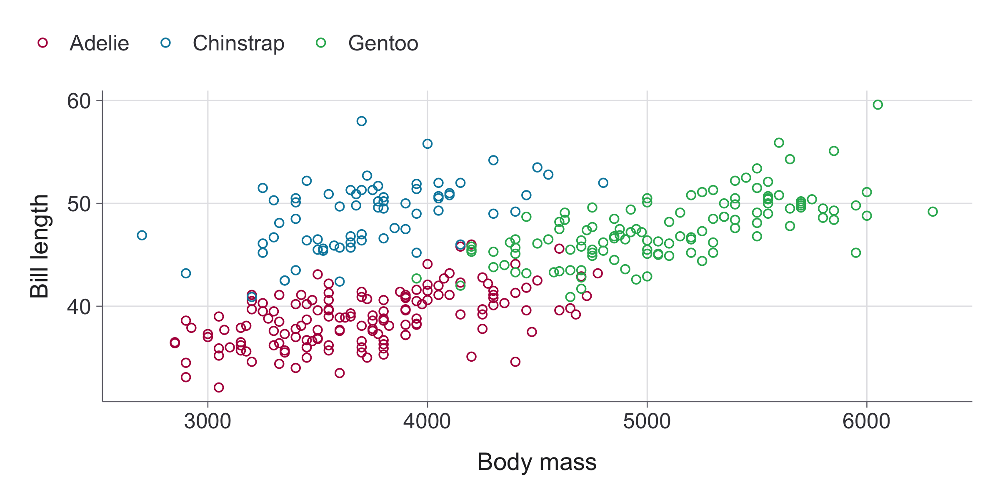
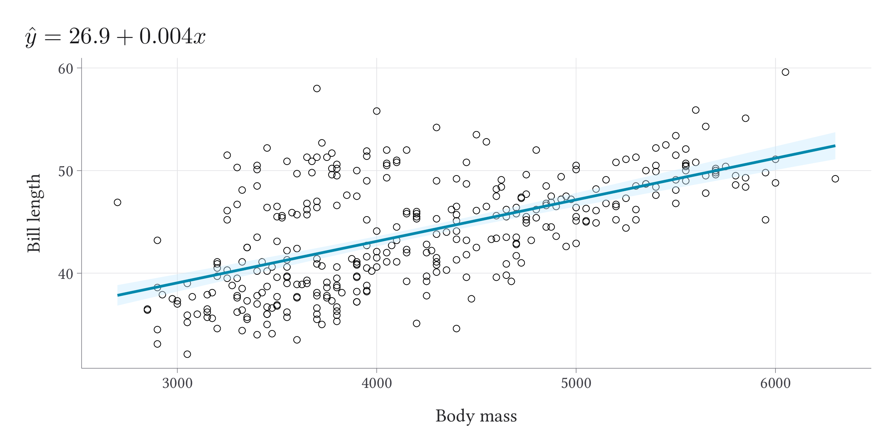
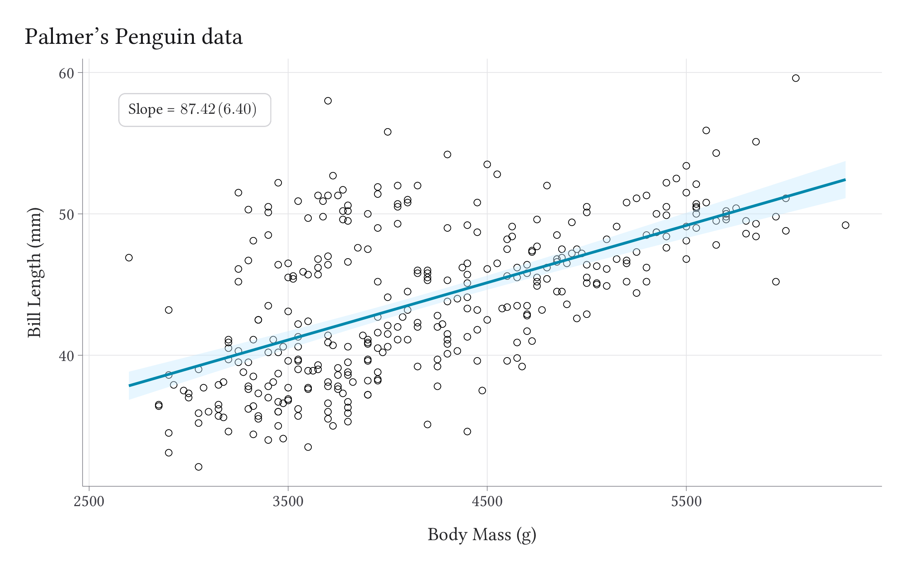

<!-- README.md is generated from README.Rmd. Please edit that file -->

# kfbmisc

<!-- badges: start -->

<!-- badges: end -->

`kfbmisc` is a package full of utility function I find useful

## Installation

You can install the development version of kfbmisc from
[GitHub](https://github.com/) with:

``` r
# install.packages("devtools")
devtools::install_github("kylebutts/kfbmisc")
```

``` r
library(kfbmisc)
```

## `ggplot2` theme

This is a relatively simple theme that makes the font larger for figures
and adds more margins around things.

``` r
library(tidyverse)
library(palmerpenguins)
penguins = penguins |> drop_na(body_mass_g, bill_length_mm, sex)
ggplot(penguins) +
  geom_point(aes(x = body_mass_g, y = bill_length_mm), shape = 21) +
  labs(
    x = "Body mass", y = "Bill length"
  ) +
  theme_kyle()
```


``` r
ggplot(penguins) +
  geom_point(aes(x = body_mass_g, y = bill_length_mm, color = species), shape = 21) +
  scale_color_manual(
    values = kfbmisc::kyle_color("magenta", "blue", "green")
  ) + 
  labs(
    x = "Body mass", y = "Bill length", color = NULL
  ) +
  theme_kyle(legend = "top")
```



``` r
ggplot(
  penguins |> mutate(sex = str_to_title(sex))
) +
  geom_point(aes(x = body_mass_g, y = bill_length_mm, color = species), shape = 21) +
  facet_wrap(~ sex) +
  scale_color_manual(
    values = kfbmisc::kyle_color("magenta", "blue", "green")
  ) + 
  labs(
    x = "Body mass", y = "Bill length", color = NULL
  ) +
  theme_kyle(legend = "top")
```


### `tikzsave`

``` r
mod = lm(bill_length_mm ~ body_mass_g, penguins)
title_str = paste0(
  "$\\hat{y} = ", round(coef(mod)[1], 1), " + ", round(coef(mod)[2], 3), "x$"
)
p = ggplot(penguins) +
  geom_point(aes(x = body_mass_g, y = bill_length_mm), shape = 21) +
  geom_smooth(
    aes(x = body_mass_g, y = bill_length_mm), 
    color = kfbmisc::kyle_color("blue"),
    fill = colorspace::lighten(kfbmisc::kyle_color("blue"), 0.8),
    method = "lm",
    formula = y ~ x,
    linewidth = 1.5,
  ) +
  labs(
    x = "Body mass", y = "Bill length",
    title = title_str
  ) +
  theme_kyle()
```

``` r
# `plot` -> `tikzpicture` -> `pdf`
tikzsave(
  "man/figures/README_penguins.pdf",
  p, width = 8, height = 4,
  # uses `imagemagick` to convert to png 
  create_png = TRUE
)
```



### Maps

``` r
library(sf)
#> Linking to GEOS 3.13.0, GDAL 3.8.5, PROJ 9.5.1; sf_use_s2() is TRUE
nc <- st_read(system.file("shape/nc.shp", package="sf"), quiet = TRUE)

ggplot(nc) +
  geom_sf(aes(fill = BIR74)) +
  scale_fill_fermenter(
    direction = 1, palette = 3,
    guide = guide_colorbar(direction = "horizontal")
  ) + 
  labs(fill = "1974 Births") +
  theme_kyle(map = TRUE) +
  theme(
    legend.position = "inside",
    legend.position.inside = c(0.1, 0.07),
    legend.justification = c(0, 1),
    legend.title.position = "top",
    legend.key.width = unit(3, "lines"),
    legend.key.height = unit(0.5, "lines")
  )
```


### Additional Examples

Most of these examples are taken from
[`pilot`](https://github.com/olihawkins/pilot). The source code can be
found in `gallery/`:

#### [Line Chart](https://github.com/kylebutts/kfbmisc/blob/master/gallery/line_chart.R)


#### [Scatter Chart](https://github.com/kylebutts/kfbmisc/blob/master/gallery/%20scatter_chart_basic.R)


#### [Scatter Chart Facets](https://github.com/kylebutts/kfbmisc/blob/master/gallery/%20scatter_chart_facets.R)


#### [Stacked Column Chart](https://github.com/kylebutts/kfbmisc/blob/master/gallery/%20stacked_column_chart.R)


#### [Custom Labels](https://github.com/kylebutts/kfbmisc/blob/master/gallery/label_ex.R)


