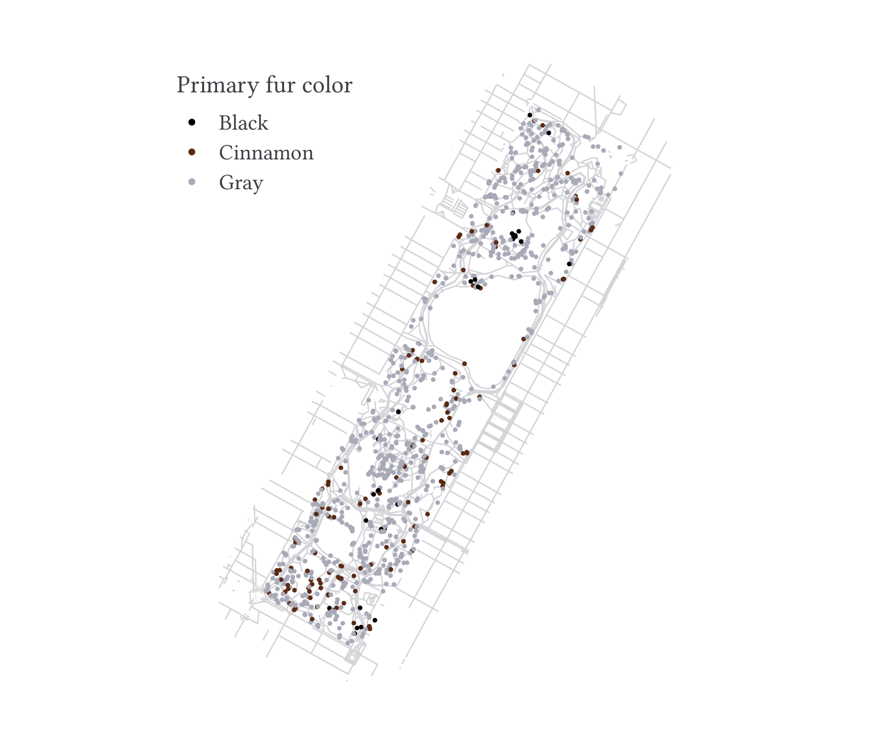

<!-- README.md is generated from README.Rmd. Please edit that file -->

# kfbmisc

<!-- badges: start -->
<!-- badges: end -->

`kfbmisc` is a package full of utility function I find useful

## Installation

You can install the development version of kfbmisc from
[GitHub](https://github.com/) with:

``` r
# install.packages("devtools")
devtools::install_github("kylebutts/kfbmisc")
```

``` r
library(kfbmisc)
```

## `ggplot2` theme

This is a relatively simple theme that makes the font larger for figures
and adds more margins around things.

``` r
library(ggplot2)
library(palmerpenguins)

penguins = subset(penguins, !is.na(body_mass_g) & !is.na(bill_length_mm))

ggplot(penguins) +
  geom_point(aes(x = body_mass_g, y = bill_length_mm)) +
  labs(
    x = "Body mass", y = "Bill length"
  ) +
  theme_kyle(base_size = 12)
```


``` r
ggplot(penguins) +
  geom_point(aes(x = body_mass_g, y = bill_length_mm)) +
  facet_wrap(~ species) +
  labs(
    x = "Body mass", y = "Bill length"
  ) +
  theme_kyle(base_size = 12)
```


### Maps

``` r
library(sf)
#> Linking to GEOS 3.11.0, GDAL 3.5.3, PROJ 9.1.0; sf_use_s2() is TRUE
nc <- st_read(system.file("shape/nc.shp", package="sf"), quiet = TRUE)

ggplot(nc) +
  geom_sf(aes(fill = BIR74)) +
  scale_fill_fermenter(
    direction = 1, palette = 3,
    guide = guide_colorbar()
  ) + 
  labs(fill = "1974 Births") +
  theme_kyle(
    base_size = 12,
  ) + 
  theme_map() +
  theme(
    legend.position = "bottom",
    legend.title.position = "top",
    legend.key.width = unit(4, "lines")
  )
```


### `tikzsave`

``` r
mod = lm(bill_length_mm ~ body_mass_g, penguins)
title_str = paste0(
  "$\\hat{y} = ", round(coef(mod)[1], 1), " + ", round(coef(mod)[2], 3), "x$"
)
p = ggplot(penguins) +
  geom_point(aes(x = body_mass_g, y = bill_length_mm)) +
  geom_smooth(
    aes(x = body_mass_g, y = bill_length_mm), 
    method = lm, formula = y ~ x
  ) +
  labs(
    x = "Body mass", y = "Bill length",
    title = title_str
  ) +
  theme_kyle(base_size = 12)
```

``` r
# `plot` -> `tikzpicture` -> `pdf`
tikzsave(
  "man/figures/README-penguins.pdf",
  p, width = 8, height = 4,
  # uses `imagemagick` to convert to png 
  create_png = TRUE
)
```


### Additional Examples

Most of these examples are taken from
[`pilot`](https://github.com/olihawkins/pilot). The source code can be
found in `gallery/`:

[Line
Chart](https://github.com/kylebutts/kfbmisc/blob/master/gallery/line-chart.R)


[Scatter
Chart](https://github.com/kylebutts/kfbmisc/blob/master/gallery/scatter-chart-basic.R)


[Scatter Chart
Facets](https://github.com/kylebutts/kfbmisc/blob/master/gallery/scatter-chart-facets.R)


[Stacked Column
Chart](https://github.com/kylebutts/kfbmisc/blob/master/gallery/stacked-column-chart.R)


[Map](https://github.com/kylebutts/kfbmisc/blob/master/gallery/map.R)


[Facet
Map](https://github.com/kylebutts/kfbmisc/blob/master/gallery/map.R)

